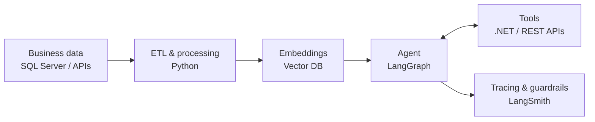

<h2>William Hideki Nakata</h2>

AI Automation Engineer & Full Stack Developer · Brazil (GMT-3)

I build AI agents and automation that run inside real business systems, backed by solid backend and data engineering. Currently at Toledo Piza, where I've shipped two production agents (LangChain, LangGraph, Azure AI Foundry) with tracing and guardrails, automated 6+ manual processes, and maintained ETL pipelines handling millions of rows per day.

Before that I spent two years teaching Computational Numerical Methods at UNESP, where I earned my BSc in Computer Science. I still care about understanding things from first principles.

### Stack

**AI & Automation**: LangChain · LangGraph · RAG · Azure AI Foundry · OpenAI API · Vector DBs · LangSmith · n8n 
**Backend**: C# (.NET, EF Core) · Python (FastAPI) · TypeScript · Node.js · REST APIs 
**Data & Infra**: SQL Server (T-SQL) · ETL · Power BI · Docker · Azure · CI/CD

<b>How I usually structure an agent system</b>

 

### Selected work

| Project | What it shows |
|---|---|
| [**starkbank-challenge**](https://github.com/hidekinakata/starkbank-challenge) | Python webhook service, hexagonal architecture, idempotent payments, signature verification, retries. `mypy --strict`, 78 tests. |
| [**NeuralNet-from-scratch**](https://github.com/hidekinakata/NeuralNet-from-scratch) | A complete neural network using only NumPy. |

Most of my professional work lives in private corporate repositories.
